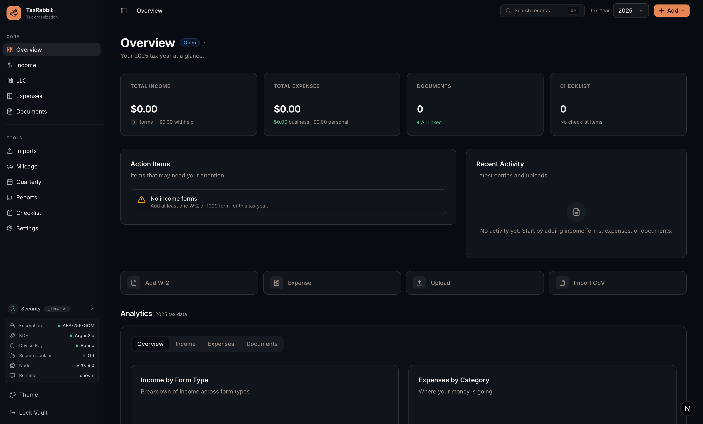
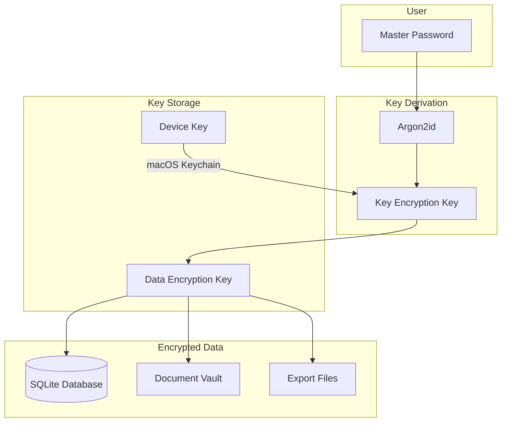
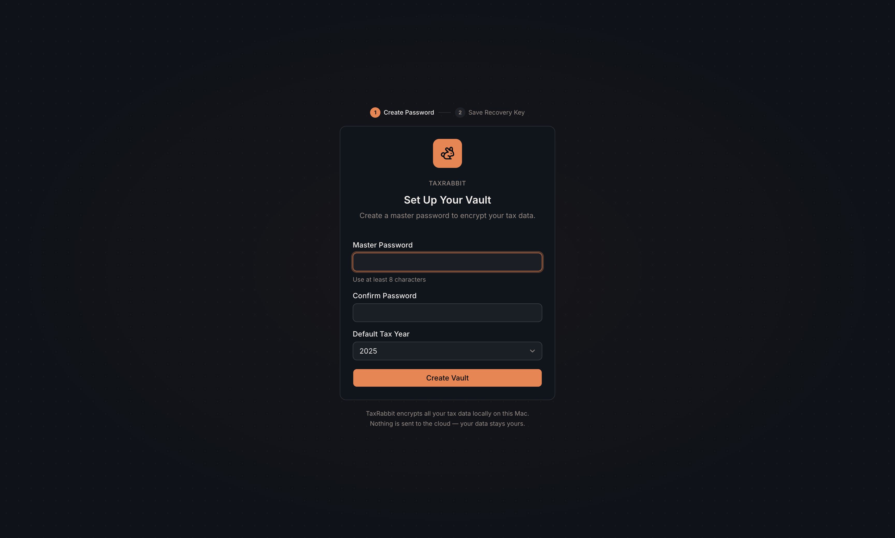
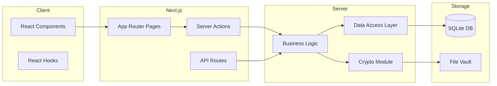
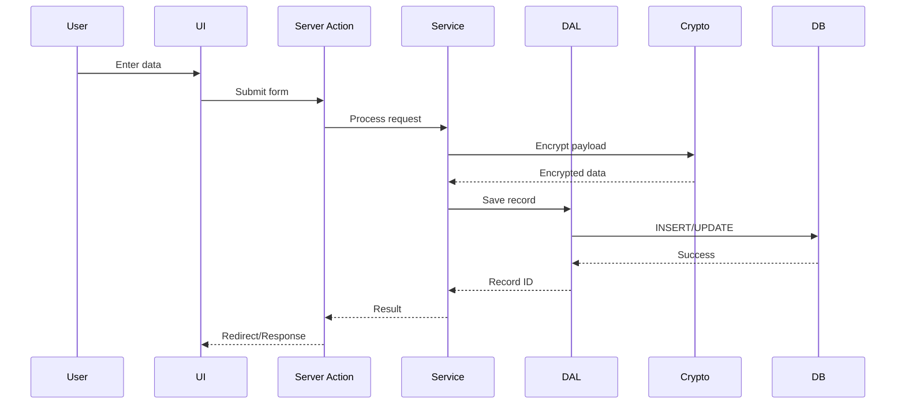

# TaxRabbit

[](https://github.com/Garrett12123/taxrabbit/actions/workflows/ci.yml)
[](https://opensource.org/licenses/MIT)
[](https://nodejs.org/)
[](https://www.apple.com/macos/)

A local-only, encrypted personal tax organizer for macOS. Fast, easy tax organization — fully offline.



## Overview

TaxRabbit helps you organize your tax documents, track income and expenses, and prepare for tax filing — all while keeping your sensitive financial data encrypted and completely offline.

### Key Features

- **Fully Offline**: No internet connection required. Your data never leaves your machine.
- **Encrypted at Rest**: All sensitive data encrypted using AES-256-GCM.
- **Personal + LLC Support**: Track both personal income and business expenses.
- **Document Vault**: Store and link receipts, W-2s, 1099s, and other tax documents.
- **Mileage Tracking**: Log business miles with IRS standard mileage rate deduction calculations.
- **Tax Estimation**: Projected federal tax liability with SE tax, bracket calculations, and withholding.
- **Quarterly Payments**: Track estimated tax payments by quarter.
- **Year-by-Year Organization**: Separate your finances by tax year.
- **Filing Checklist**: Track preparation progress for each tax year.
- **CPA-Ready Exports**: Generate summary reports and document packages.
- **Theme Support**: 10 color themes with light/dark mode and system preference detection.

### What You Can Track

| Income | Expenses | Mileage & Payments | Documents |
|--------|----------|--------------------|-----------|
| W-2 (wages) | Personal expenses | Business miles driven | PDF receipts |
| 1099-NEC (contract) | LLC/business expenses | IRS mileage deductions | Tax form scans |
| 1099-INT (interest) | Categorized spending | Quarterly estimated payments | Supporting documents |
| 1099-DIV (dividends) | Vendor tracking | Filing checklist | Linked attachments |
| 1099-MISC | Receipt attachments | | |
| 1099-K (gig/marketplace) | | | |

### CPA-Ready Data Capture

Income forms capture all fields a CPA would need:

- **Payer/Employer Info**: Name, EIN, full address (street, city, state, ZIP)
- **W-2 Complete**: All boxes including tips (7, 8), benefits (10, 11), Box 12 codes, Box 13 checkboxes, and state/local
- **1099 Forms**: Account numbers, federal/state income and withholding
- **Control Numbers**: W-2 Box d and 1099 account numbers for record matching

## Security Model



- **Master Password**: Only you know it. Never stored.
- **Key Encryption Key (KEK)**: Derived from your password using Argon2id.
- **Data Encryption Key (DEK)**: Random key that encrypts your data, wrapped by KEK.
- **Device Key**: Additional protection stored in macOS Keychain.

## Getting Started

### Prerequisites

- macOS (tested on Sonoma+)
- Node.js 20+
- npm

### Installation

```bash
# Clone the repository
git clone https://github.com/Garrett12123/taxrabbit.git
cd taxrabbit

# Install dependencies
npm install

# Run the development server
npm run dev
```

Open [http://localhost:3000](http://localhost:3000) to access the app.

### First Launch

1. **Create Your Vault**: Set a strong master password (minimum 8 characters)
2. **Select Default Tax Year**: Choose the tax year to start organizing
3. **Start Organizing**: Add income documents, expenses, and receipts



## Docker

Run TaxRabbit in a container, accessible at `http://localhost:3000`.

### Quick Start

```bash
docker compose up -d
```

### Environment Variables

| Variable | Default | Description |
|----------|---------|-------------|
| `VAULT_STORAGE_DIR` | macOS `~/Library/Application Support/taxrabbit/vault` | Directory for encrypted document storage |
| `SECURE_COOKIES` | *(unset — uses NODE_ENV)* | Set to `false` for HTTP localhost (required in Docker) |
| `HOSTNAME` | `localhost` | Set to `0.0.0.0` to listen on all interfaces |

### Data Persistence

A named Docker volume (`taxrabbit-data`) stores the database, vault config, audit log, and encrypted documents under `/app/data`. Data persists across container restarts.

To use a bind mount instead:

```yaml
volumes:
  - ./my-data:/app/data
```

### Security Note

The Docker container does **not** have access to macOS Keychain, so the device key binding is unavailable. Encryption still uses AES-256-GCM with Argon2id key derivation from your master password. No recovery key is generated in this mode.

## Architecture



## Project Structure

```
taxrabbit/
├── app/                      # Next.js App Router
│   ├── (auth)/               # Setup and unlock flows
│   │   ├── setup/            # First-time vault creation
│   │   └── unlock/           # Password unlock screen
│   ├── (modules)/            # Main application modules
│   │   ├── overview/         # Dashboard with charts
│   │   ├── income/           # Income form management
│   │   ├── expenses/         # Expense tracking
│   │   ├── mileage/          # Business mileage tracking
│   │   ├── estimated-payments/ # Quarterly tax payments
│   │   ├── documents/        # Document vault
│   │   ├── imports/          # CSV import wizard
│   │   ├── llc/              # LLC business profile
│   │   ├── checklist/        # Filing preparation checklist
│   │   ├── reports/          # Exports and backups
│   │   ├── search/           # Global search
│   │   └── settings/         # App configuration
│   └── api/                  # API routes for exports
├── components/
│   ├── ui/                   # shadcn/ui base components
│   ├── layout/               # Sidebar, topbar, theme
│   ├── charts/               # Recharts visualizations
│   ├── common/               # Shared components (CSV export, etc.)
│   ├── dashboard/            # Dashboard widgets
│   ├── forms/                # Income form components
│   ├── expenses/             # Expense components
│   ├── mileage/              # Mileage tracking components
│   ├── estimated-payments/   # Quarterly payment components
│   ├── documents/            # Document components
│   ├── imports/              # CSV import components
│   ├── checklist/            # Filing checklist components
│   ├── reports/              # Export components
│   ├── tax-year/             # Year status & filing components
│   └── settings/             # Settings components
├── server/
│   ├── db/                   # Database layer
│   │   ├── schema.ts         # Drizzle schema
│   │   ├── dal/              # Data access layer
│   │   └── migrations/       # SQL migrations
│   ├── security/             # Encryption & auth
│   │   ├── crypto.ts         # AES-256-GCM encryption
│   │   ├── kdf.ts            # Argon2id key derivation
│   │   ├── keychain.ts       # macOS Keychain integration
│   │   ├── session.ts        # Session management
│   │   ├── rate-limit.ts     # Authentication rate limiting
│   │   ├── audit-log.ts      # Security audit logging
│   │   └── vault.ts          # Vault configuration
│   ├── services/             # Business logic
│   └── storage/              # Encrypted file storage
├── lib/                      # Shared utilities
│   ├── constants.ts          # App constants & box definitions
│   ├── utils.ts              # Formatting & helper functions
│   ├── errors.ts             # Error types & Zod formatting
│   ├── types/                # TypeScript type definitions
│   ├── validation/           # Zod schemas
│   ├── csv/                  # CSV parsing & generation
│   ├── html/                 # HTML report templates
│   ├── audit.ts              # Data audit utilities
│   ├── completeness.ts       # Form completeness scoring
│   ├── themes.ts             # Color theme definitions
│   ├── motion.ts             # Animation utilities
│   └── offline-guard.ts      # Network request blocking
├── hooks/                    # React hooks
├── tests/                    # Vitest tests
└── data/                     # Local data directory
```

## Data Flow



## Tech Stack

| Category | Technology |
|----------|------------|
| Framework | Next.js 16 (App Router) |
| UI | shadcn/ui + Tailwind CSS v4 |
| Database | SQLite via better-sqlite3 |
| ORM | Drizzle ORM |
| Encryption | AES-256-GCM, Argon2id |
| Keychain | @napi-rs/keyring |
| Charts | Recharts |
| Testing | Vitest |
| Validation | Zod v4 |

## Scripts

```bash
npm run dev        # Start development server
npm run build      # Build for production
npm run start      # Start production server
npm run lint       # Run ESLint
npm run test       # Run tests in watch mode
npm run test:run   # Run tests once
npm run db:generate # Generate Drizzle migrations
npm run db:migrate  # Run database migrations
```

## Data Storage

All data is stored locally in the project's `data/` directory:

```
data/
├── taxrabbit.db      # SQLite database
└── vault.json        # Vault configuration
```

Document files are stored in:

```
~/Library/Application Support/taxrabbit/vault/
├── [uuid-1]          # Encrypted document blob
├── [uuid-2]
└── ...
```

## Theming

The app ships with 10 color themes: Modern Minimalist (default), Ocean Depths, Sunset Boulevard, Forest Canopy, Golden Hour, Arctic Frost, Desert Rose, Tech Innovation, Botanical Garden, and Midnight Galaxy.

Three appearance modes are available for each theme:

- **Light**: Bright background with dark text
- **Dark**: Dark background with light text
- **System**: Automatically follows your macOS appearance setting

Access the theme switcher via the sidebar.

## Privacy & Security

- **No Cloud Sync**: Data exists only on your local machine
- **No Analytics**: Zero telemetry or tracking
- **No External Calls**: Runtime network requests are blocked via offline guard
- **Encrypted Storage**: All sensitive fields encrypted with AES-256-GCM
- **Your Data, Your Control**: Export or delete anytime

## Disclaimer

This is a **personal organizer tool**, not tax software. It helps you collect and organize tax-related information. Tax estimates are approximate projections only and should not be relied upon for filing. This tool does not provide tax advice or file returns. Consult a qualified tax professional for tax advice.

## Contributing

This is a personal open-source project, and contributions are welcome! Please read the [Contributing Guide](CONTRIBUTING.md) before submitting a Pull Request.

## Security

For security concerns, please see the [Security Policy](SECURITY.md). Do not report security vulnerabilities through public GitHub issues.

## License

This project is licensed under the MIT License - see the [LICENSE](LICENSE) file for details.
