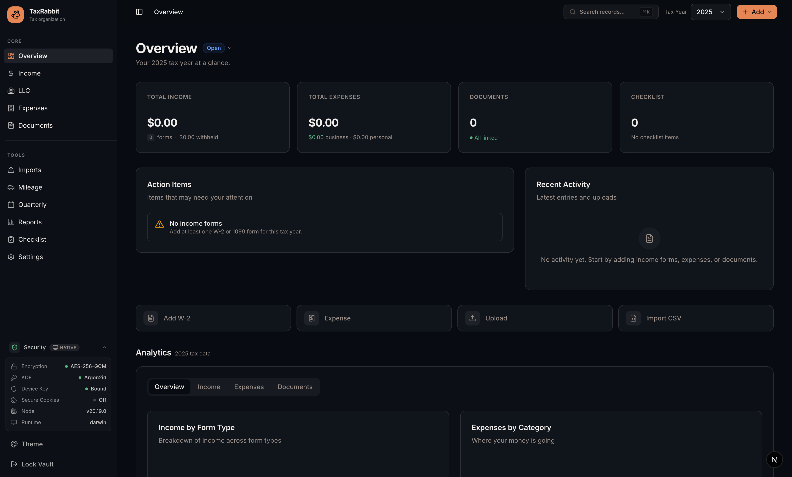
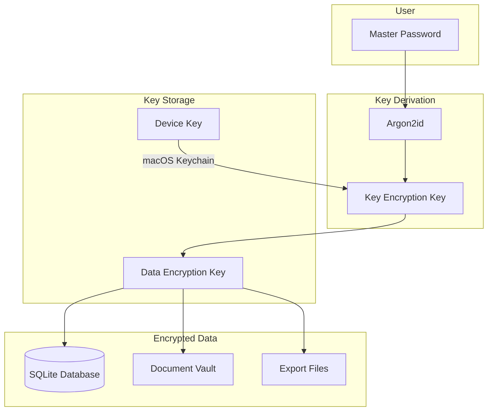
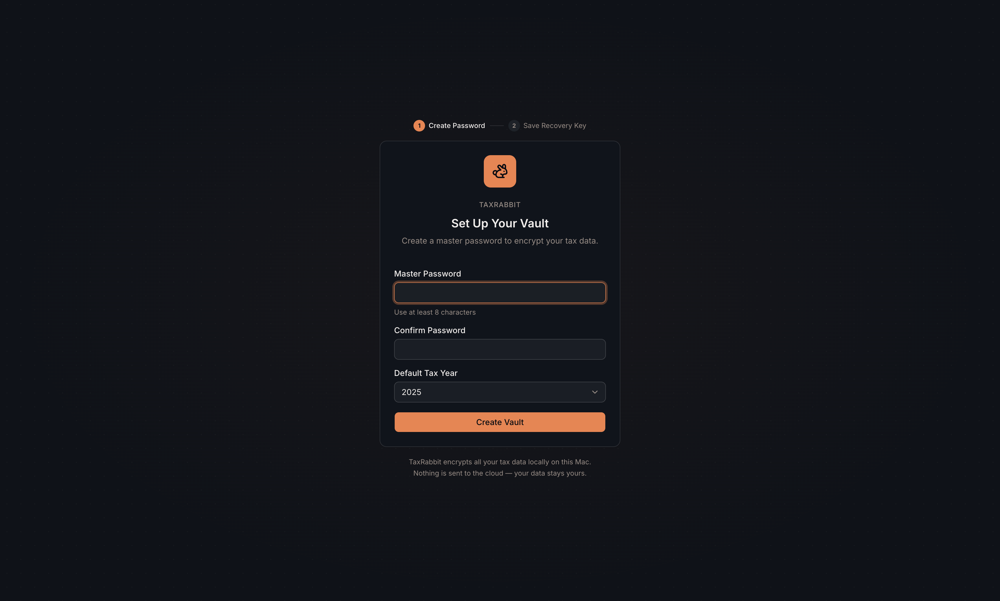
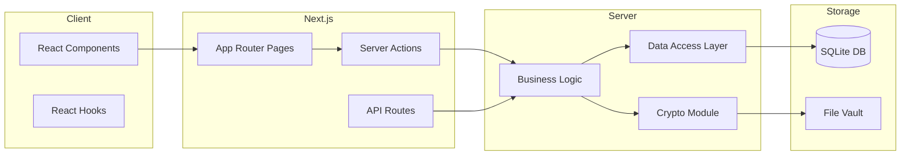
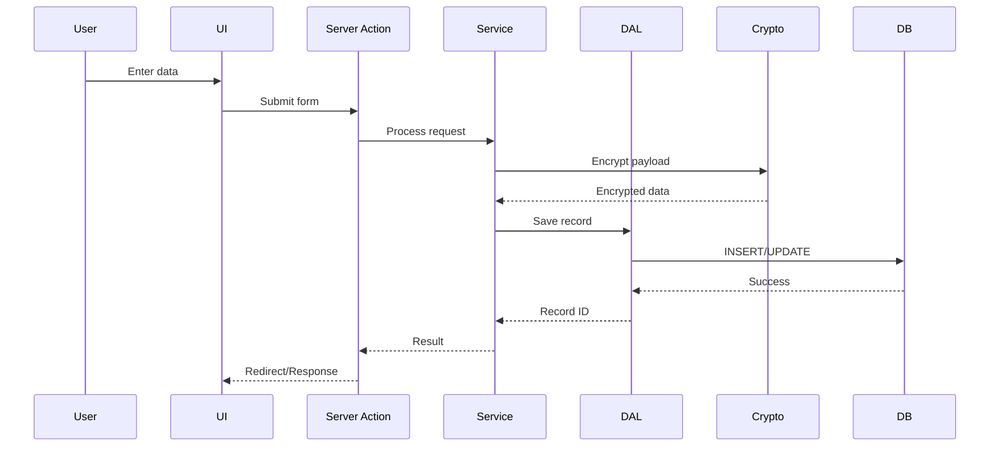

# TaxRabbit

[](https://github.com/Garrett12123/taxrabbit/actions/workflows/ci.yml)
[](https://opensource.org/licenses/MIT)
[](https://nodejs.org/)
[](https://www.apple.com/macos/)

A local-only, encrypted personal tax organizer for macOS. Fast, easy tax organization — fully offline.



## Overview

TaxRabbit helps you organize your tax documents, track income and expenses, and prepare for tax filing — all while keeping your sensitive financial data encrypted and completely offline.

### Key Features

- **Fully Offline**: No internet connection required. Your data never leaves your machine.
- **Encrypted at Rest**: All sensitive data encrypted using AES-256-GCM with Argon2id key derivation.
- **Personal + LLC Support**: Track both personal income and business expenses.
- **Document Vault**: Store and link receipts, W-2s, 1099s, and other tax documents.
- **Mileage Tracking**: Log business miles with IRS standard mileage rate deduction calculations.
- **Utility Bill Tracking**: Track utility costs with home office percentage deduction calculations.
- **Tax Estimation**: Projected federal tax liability with SE tax, Additional Medicare Tax, bracket calculations, and withholding.
- **Quarterly Payments**: Track estimated tax payments by quarter with payment confirmation tracking.
- **Smart Paste**: Paste data from W-2/1099 PDFs and utility provider websites — fields are auto-extracted and matched.
- **Bulk CSV Import**: Import expenses and mileage from bank/app CSV exports with auto-column detection.
- **CPA Export Packet**: Professional export with styled PDF summary, multi-sheet XLSX workbook, DOCX cover letter, raw CSVs, and document attachments.
- **Backup & Restore**: Full encrypted vault backup with integrity validation and one-click restore.
- **Year-by-Year Organization**: Separate your finances by tax year.
- **Filing Checklist**: Track preparation progress for each tax year.
- **Auto-Lock**: Configurable session timeout with automatic vault locking.
- **Recovery Key**: Device-bound recovery key for vault access if Keychain is lost.
- **Theme Support**: 10 color themes with light/dark mode and system preference detection.

### What You Can Track

| Income | Expenses | Utilities | Mileage & Payments | Documents |
|--------|----------|-----------|-------------------|-----------|
| W-2 (wages) | Personal expenses | Electric | Business miles driven | PDF receipts |
| 1099-NEC (contract) | LLC/business expenses | Water | IRS mileage deductions | Tax form scans |
| 1099-INT (interest) | Categorized spending | Gas | Quarterly estimated payments | Supporting documents |
| 1099-DIV (dividends) | Vendor tracking | Internet | Filing checklist | Linked attachments |
| 1099-MISC | Receipt attachments | Trash | | |
| 1099-K (gig/marketplace) | | Other | | |
| Other (custom) | | | | |

### CPA-Ready Data Capture

Income forms capture all fields a CPA would need:

- **Payer/Employer Info**: Name, EIN, full address (street, city, state, ZIP)
- **W-2 Complete**: All boxes including tips (7, 8), benefits (10, 11), Box 12 codes, Box 13 checkboxes, and state/local
- **1099 Forms**: Account numbers, federal/state income and withholding
- **Control Numbers**: W-2 Box d and 1099 account numbers for record matching
- **Smart Paste**: Paste raw text from a PDF and fields are auto-extracted using token matching

### CPA Export Packet

Generate a professional, Google Drive-ready export package:

```
TaxRabbit CPA Packet - 2025/
├── Tax Summary 2025.pdf          # Multi-page PDF with cover page, tables, and tax estimate
├── Financial Data 2025.xlsx      # Styled workbook: Summary, Income, Expenses, Mileage, Utilities, Payments, Tax Estimate
├── Cover Letter 2025.docx        # Taxpayer info, financial summary, packet contents, security notice
├── data/                         # Raw CSVs for import into tax preparation software
│   ├── income.csv
│   ├── expenses.csv
│   ├── mileage.csv
│   ├── utility-bills.csv
│   └── estimated-payments.csv
└── documents/                    # Decrypted document attachments (optional)
    ├── income/
    ├── expenses/
    └── other/
```

- **PDF**: Branded cover page, KPI boxes, styled tables with alternating rows, tax estimate breakdown, page numbers
- **XLSX**: 7 sheets with green-branded headers, currency formatting, auto-filters, totals, alternating stripes — opens natively in Google Sheets
- **DOCX**: Professional cover letter with key-value tables — opens natively in Google Docs

### Import & Paste Options

- **CSV Import**: Import expenses and mileage from bank statements or app exports. Auto-detects column mappings with manual override.
- **Utility Quick Paste**: Paste billing data from provider websites (tab-separated, block format, or CSV with headers like `Date Start,Date End,Amount`).
- **Smart Paste for Income**: Paste raw text from W-2/1099 PDFs — tokens are extracted and matched to form fields automatically.

## Security Model


```mermaid
flowchart TB
    subgraph User
        MP[Master Password]
    end

    subgraph Key Derivation
        MP --> Argon2id
        Argon2id --> KEK[Key Encryption Key]
    end

    subgraph Key Storage
        DK[Device Key] --> |macOS Keychain| KEK
        KEK --> DEK[Data Encryption Key]
    end

    subgraph Encrypted Data
        DEK --> DB[(SQLite Database)]
        DEK --> Vault[Document Vault]
        DEK --> Exports[Export Files]
    end
```

- **Master Password**: Only you know it. Never stored.
- **Key Encryption Key (KEK)**: Derived from your password using Argon2id (with scrypt fallback).
- **Data Encryption Key (DEK)**: Random key that encrypts your data, wrapped by KEK.
- **Device Key**: Additional protection stored in macOS Keychain (native only, not available in Docker).
- **Recovery Key**: Generated when device key is enabled — allows vault recovery if Keychain is lost.
- **Auto-Lock**: Configurable session timeout (default 30 min) clears the DEK from memory.
- **Rate Limiting**: Failed unlock attempts are rate-limited with exponential backoff.
- **Audit Logging**: Security events (unlock, lock, setup, failed attempts) are logged to `data/audit.log`.

## Getting Started

### Prerequisites

- macOS (tested on Sonoma+)
- Node.js 20+
- npm

### Installation

```bash
# Clone the repository
git clone https://github.com/Garrett12123/taxrabbit.git
cd taxrabbit

# Install dependencies
npm install

# Run the development server
npm run dev
```

Open [http://localhost:3000](http://localhost:3000) to access the app.

### First Launch

1. **Create Your Vault**: Set a strong master password (minimum 8 characters)
2. **Select Default Tax Year**: Choose the tax year to start organizing
3. **Start Organizing**: Add income documents, expenses, and receipts



## Docker

Run TaxRabbit in a container, accessible at `http://localhost:3000`.

### Quick Start

```bash
docker compose up -d
```

### Environment Variables

| Variable | Default | Description |
|----------|---------|-------------|
| `VAULT_STORAGE_DIR` | macOS `~/Library/Application Support/taxrabbit/vault` | Directory for encrypted document storage |
| `SECURE_COOKIES` | *(unset — uses NODE_ENV)* | Set to `false` for HTTP localhost (required in Docker) |
| `HOSTNAME` | `localhost` | Set to `0.0.0.0` to listen on all interfaces |

### Data Persistence

A named Docker volume (`taxrabbit-data`) stores the database, vault config, audit log, and encrypted documents under `/app/data`. Data persists across container restarts.

To use a bind mount instead:

```yaml
volumes:
  - ./my-data:/app/data
```

### Security Note

The Docker container does **not** have access to macOS Keychain, so the device key binding is unavailable. Encryption still uses AES-256-GCM with Argon2id key derivation from your master password. No recovery key is generated in this mode.

## Architecture


```mermaid
flowchart LR
    subgraph Client
        UI[React Components]
        Hooks[React Hooks]
    end

    subgraph Next.js
        Pages[App Router Pages]
        Actions[Server Actions]
        API[API Routes]
    end

    subgraph Server
        Services[Business Logic]
        DAL[Data Access Layer]
        Security[Crypto Module]
    end

    subgraph Storage
        SQLite[(SQLite DB)]
        Vault[File Vault]
    end

    UI --> Pages
    Pages --> Actions
    Actions --> Services
    API --> Services
    Services --> DAL
    Services --> Security
    DAL --> SQLite
    Security --> Vault
```

## Project Structure

```
taxrabbit/
├── app/                      # Next.js App Router
│   ├── (auth)/               # Setup and unlock flows
│   │   ├── setup/            # First-time vault creation
│   │   └── unlock/           # Password unlock screen
│   ├── (modules)/            # Main application modules
│   │   ├── overview/         # Dashboard with charts
│   │   ├── income/           # Income form management
│   │   ├── expenses/         # Expense tracking
│   │   ├── mileage/          # Business mileage tracking
│   │   ├── estimated-payments/ # Quarterly tax payments
│   │   ├── documents/        # Document vault
│   │   ├── imports/          # CSV import wizard
│   │   ├── llc/              # LLC business profile
│   │   ├── checklist/        # Filing preparation checklist
│   │   ├── utilities/        # Utility bill tracking
│   │   ├── reports/          # Exports and backups
│   │   ├── search/           # Global search
│   │   └── settings/         # App configuration
│   └── api/                  # API routes for exports
├── components/
│   ├── ui/                   # shadcn/ui base components
│   ├── layout/               # Sidebar, topbar, theme
│   ├── charts/               # Recharts visualizations
│   ├── common/               # Shared components (CSV export, etc.)
│   ├── dashboard/            # Dashboard widgets
│   ├── forms/                # Income form components
│   ├── expenses/             # Expense components
│   ├── mileage/              # Mileage tracking components
│   ├── utilities/            # Utility bill components
│   ├── estimated-payments/   # Quarterly payment components
│   ├── documents/            # Document components
│   ├── imports/              # CSV import components
│   ├── checklist/            # Filing checklist components
│   ├── reports/              # Export components
│   ├── tax-year/             # Year status & filing components
│   └── settings/             # Settings components
├── server/
│   ├── db/                   # Database layer
│   │   ├── schema.ts         # Drizzle schema
│   │   ├── dal/              # Data access layer
│   │   └── migrations/       # SQL migrations
│   ├── security/             # Encryption & auth
│   │   ├── crypto.ts         # AES-256-GCM encryption
│   │   ├── kdf.ts            # Argon2id key derivation
│   │   ├── keychain.ts       # macOS Keychain integration
│   │   ├── session.ts        # Session management
│   │   ├── rate-limit.ts     # Authentication rate limiting
│   │   ├── audit-log.ts      # Security audit logging
│   │   └── vault.ts          # Vault configuration
│   ├── services/             # Business logic
│   └── storage/              # Encrypted file storage
├── lib/                      # Shared utilities
│   ├── constants.ts          # App constants & box definitions
│   ├── utils.ts              # Formatting & helper functions
│   ├── errors.ts             # Error types & Zod formatting
│   ├── types/                # TypeScript type definitions
│   ├── validation/           # Zod schemas
│   ├── csv/                  # CSV parsing & generation
│   ├── export/               # PDF, XLSX, DOCX generators
│   ├── html/                 # HTML report templates
│   ├── smart-paste/          # Token extraction for W-2/1099 paste
│   ├── utility-paste/        # Utility bill paste parser
│   ├── audit.ts              # Data audit utilities
│   ├── completeness.ts       # Form completeness scoring
│   ├── themes.ts             # Color theme definitions
│   ├── motion.ts             # Animation utilities
│   └── offline-guard.ts      # Network request blocking
├── hooks/                    # React hooks
├── tests/                    # Vitest tests
└── data/                     # Local data directory
```

## Data Flow


```mermaid
sequenceDiagram
    participant User
    participant UI
    participant Action as Server Action
    participant Service
    participant DAL
    participant Crypto
    participant DB

    User->>UI: Enter data
    UI->>Action: Submit form
    Action->>Service: Process request
    Service->>Crypto: Encrypt payload
    Crypto-->>Service: Encrypted data
    Service->>DAL: Save record
    DAL->>DB: INSERT/UPDATE
    DB-->>DAL: Success
    DAL-->>Service: Record ID
    Service-->>Action: Result
    Action-->>UI: Redirect/Response
```

## Tech Stack

| Category | Technology |
|----------|------------|
| Framework | Next.js 16 (App Router) |
| UI | shadcn/ui + Tailwind CSS v4 |
| Database | SQLite via better-sqlite3 |
| ORM | Drizzle ORM |
| Encryption | AES-256-GCM, Argon2id |
| Keychain | @napi-rs/keyring |
| Charts | Recharts |
| PDF Export | PDFKit |
| Spreadsheet Export | ExcelJS |
| Document Export | docx |
| Archive | Archiver + AdmZip |
| Testing | Vitest |
| Validation | Zod v4 |

## Scripts

```bash
npm run dev        # Start development server
npm run build      # Build for production
npm run start      # Start production server
npm run lint       # Run ESLint
npm run test       # Run tests in watch mode
npm run test:run   # Run tests once
npm run db:generate # Generate Drizzle migrations
npm run db:migrate  # Run database migrations
```

## Data Storage

All data is stored locally in the project's `data/` directory:

```
data/
├── taxrabbit.db       # SQLite database (WAL mode)
├── vault.json         # Vault configuration & wrapped DEK
├── audit.log          # Security event log
└── vault/             # Encrypted document blobs (Docker)
    ├── [uuid-1]
    └── ...
```

On native macOS, document files are stored separately:

```
~/Library/Application Support/taxrabbit/vault/
├── [uuid-1]           # Encrypted document blob
├── [uuid-2]
└── ...
```

## Theming

The app ships with 10 color themes: Modern Minimalist (default), Ocean Depths, Sunset Boulevard, Forest Canopy, Golden Hour, Arctic Frost, Desert Rose, Tech Innovation, Botanical Garden, and Midnight Galaxy.

Three appearance modes are available for each theme:

- **Light**: Bright background with dark text
- **Dark**: Dark background with light text
- **System**: Automatically follows your macOS appearance setting

Access the theme switcher via the sidebar.

## Privacy & Security

- **No Cloud Sync**: Data exists only on your local machine
- **No Analytics**: Zero telemetry or tracking
- **No External Calls**: Runtime network requests are blocked via offline guard
- **Encrypted Storage**: All sensitive fields encrypted with AES-256-GCM
- **Session Security**: DEK held in memory only while unlocked, auto-cleared on timeout
- **Rate-Limited Auth**: Failed unlock attempts trigger exponential backoff
- **Audit Trail**: Security events logged locally for review
- **Your Data, Your Control**: Full backup/restore, CPA export, or delete anytime

## Disclaimer

This is a **personal organizer tool**, not tax software. It helps you collect and organize tax-related information. Tax estimates are approximate projections only and should not be relied upon for filing. This tool does not provide tax advice or file returns. Consult a qualified tax professional for tax advice.

## Contributing

This is a personal open-source project, and contributions are welcome! Please read the [Contributing Guide](CONTRIBUTING.md) before submitting a Pull Request.

## Security

For security concerns, please see the [Security Policy](SECURITY.md). Do not report security vulnerabilities through public GitHub issues.

## License

This project is licensed under the MIT License - see the [LICENSE](LICENSE) file for details.
